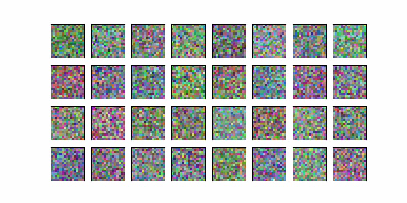

# Sampling

- Neural network tries to fully predict the noise at each step.
  - Predicted noise: Noise that the trained neural network wants to subtract from the original noise to get something that looks more sprite-like.
  - Iteration details:
    - The neural network expects a noisy sample as input.
    - We can add in additional noise before it gets passed to the next step.
  - Empirically, this stabilizes the neural network so it doesn't collapse to something closer to the average of the dataset.
- Normalizing by $1/\sqrt{2}$ after adding residual
  - [Stackexchange thread](https://stats.stackexchange.com/questions/553634/understanding-normalisations-in-stylegan2-and-on-general) attempts an explanation
    - Variance increases on addition of random variables.
    - Explains that if variance of both random variables are same then that out lead to doubling of variance which would in turn lead to **gradient explosion** when there are multiple layers.

## [Notebook](../code/L1_Sampling.ipynb)

- [matplotlib.axes.Axes.set_xticks](https://matplotlib.org/stable/api/_as_gen/matplotlib.axes.Axes.set_xticks.html) should be used in place of `set_ssticks`. Similarly for y.
- Observation:
  - For random noise added to the sampling, we should use `torch.randn_like`. This generates random numbers from standard normal distribition. By mistake I used `torch.rand_like` which generates random numbers from standard uniform distribution. That failed to generate sprite images.
- Sampling output: Generating sprites from noise
  - 
